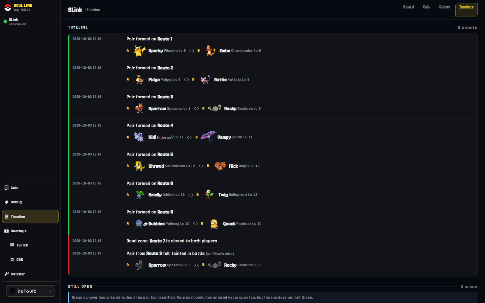

<div align="center">


# Auto-SoulLink

**Two-player Pokémon Soul Link Nuzlocke automation. No spreadsheets, no honour system.**

<a href="https://github.com/howeasy/Auto-SoulLink/actions/workflows/test.yml"></a>
<a href="LICENSE"></a>

<br><br>


</div>

## What it does

A Soul Link Nuzlocke is two players, two copies of the same game, and one rule: the first Pokémon you each catch in an area become a pair. If one of them dies, so does the other.

SLink reads both games while you play and applies that rule for you. Your first catches in an area are paired as soon as both land. When one Pokémon faints, its partner faints in the other game, mid-battle if need be. A shared board and stream overlays keep track of everything, so nobody has to.

Both games run in [BizHawk](https://github.com/TASEmulators/BizHawk). Each emulator runs a small Lua client that reports to a Python server, which enforces the rules and serves the web pages.

## The rules

| Rule | What happens |
|---|---|
| One encounter per area | Each player's first catch in an area is linked to the other player's first catch there. |
| Missed encounter | If either player fails to catch in an area, it's closed for both. |
| Shared faints | When one Pokémon faints, SLink faints its partner in the other game. |
| Linked teams | Both halves of a pair go in the party together, or in the PC together. |
| Memorial | Fallen pairs are moved to a memorial box once both games are somewhere safe. |
| When it starts | The rules switch on once you have Poké Balls. |

### Run options

Pick these when you create a run. The form greys out anything the chosen game can't do and says why.

| Option | What it does | Games |
|---|---|---|
| Species, Gender, Type Clause | Refuse a link when both Pokémon share an evolution family, a gender, or a type. | All (no Gender Clause on Gen 1) |
| Explode Mode | When your partner's Pokémon dies, yours is forced to use Explosion. | All except Emerald Expansion |
| Rival Swap | Rival battles use your partner's real team instead of the usual one. | All except Emerald Expansion |
| Native Sounds | Run events play sounds through the game itself. | Patched games |
| Phone Calls | Your partner rings your Pokégear when a pair links, an area closes or a Pokémon falls. | Gold, Silver, Crystal |
| Battle Calc | Shows the damage of the highlighted move in battle. | Radical Red |

## Get started

You need Python 3.11+, BizHawk 2.11+ (Gen 2 also runs on 2.9+), and your own copy of each game. No ROMs are included.

Install the requirements and start the Run Manager:

```bash
pip install -r requirements.txt
python -m server.manager --host 0.0.0.0
```

Then open http://localhost:8090/.


1. Create a run. Name it, pick the game family and the options you want. Where the game supports it, you can also have the Manager randomize the cartridges.
2. Download each player's setup. On the run page, open **Launchers** and download the Player A and Player B setup ZIPs, plus each player's prepared cartridge.
3. Connect. Each player unzips their setup, opens the cartridge in BizHawk and loads their save, then opens the launcher in the Lua Console.
4. Play. Your first catches in the same area form a pair.

For a player on another machine, set **Players connect to** under Launchers to an address they can reach, then download their setup again.

Each run gets its own board, on port 8081 and up. Port 8080 is only used when you start a single run by hand with `python -m server.server`.

## Games

Both players pick from the same family. Red links with Blue, for example, and a Radical Red run is Radical Red on both sides.

| Family | Randomizer |
|---|---|
| Red, Blue, Yellow | Yes |
| PureRed, PureBlue, PureGreen ([pureRGB](https://github.com/Vortyne/pureRGB)) | Yes |
| Gold, Silver, Crystal | No |
| FireRed, LeafGreen | Yes |
| Emerald | Yes |
| Radical Red 4.1 | No |
| Emerald Expansion | No |

The randomizer is your own copy of Universal Pokémon Randomizer ZX. Both cartridges get the same settings and different seeds.

SLink is tested in BizHawk, but not every game has been played start to finish. Gen 4 and Gen 5 support is experimental and isn't offered in the Manager yet.

## The companion patch

Every game in the list except Yellow and the Emerald Expansion needs the SLink companion patch, and a clean cartridge of those games won't connect. The Manager patches each cartridge it prepares, so you only need to think about it if you bring your own. In that case, use `/patcher` on the Manager.

The patch puts SLink inside the game:

- a SoulLink title screen, with the patch version on the main menu;
- the SLINK panel in the START menu, so you can check the run without leaving the game;
- in-game trades between linked Pokémon, at the Cable Club receptionist on Gen 1 and Gen 2, or a trader in the Pokémon Center on Gen 3. You can only trade a Pokémon for its own partner.

More in the [companion patch guide](patch/README.md).

## The board


Each player gets a card showing their area, their lead or current battle, and HP and moves. In battle, it also previews how much damage each move will do. Below that, pairs are sorted into in party, waiting for a partner, boxed and fallen. The event log runs down the side.

If the server stops answering, the board says "Connection lost" instead of showing old numbers. If an in-game trade ends in a state SLink can't settle on its own, a banner on the board lets you settle it.

## Timeline



The timeline tells the run in order: every pair formed, every death, dead zone and burial, plus the areas that are still open.

## Damage calculator


The calculator has a SLink panel with both players' live parties, so you can check a matchup without typing your team in. On Gen 3 runs, the Prep tab lists upcoming key trainers, and you can open any of their Pokémon straight in the calculator.

## Streaming


**Broadcast** lists every overlay with its URL and recommended size, ready to add to OBS as a browser source. There are overlays for each party, linked pairs, battles, badges, the event feed, area and encounter trackers, death and attempt counters, and the memorial.

The same page sets up OBS scene switching on run events and a Twitch bot that answers `!partner`, `!rip` and `!runstats`. Those need a few extra packages:

```bash
pip install "twitchio>=3.0" "simpleobsws>=1.4" psutil
```

## More documentation

- [Companion patch guide](patch/README.md): which games need it and how to patch your own cartridge.
- [Technical reference](docs/REFERENCE.md): server options, the protocol and how SLink works inside.

## Licence and credits

SLink is [MIT licensed](LICENSE). The bundled calculator keeps its upstream MIT licence, and the Universal Pokémon Randomizer ZX patches are GPL-3.0. See [NOTICE.md](NOTICE.md) for details.

No ROMs or savestates are distributed here.

Built with [BizHawk](https://github.com/TASEmulators/BizHawk), the [Smogon damage calculator](https://github.com/smogon/damage-calc), and research from the [pret disassemblies](https://github.com/pret).

<sub>Pokémon is a trademark of Nintendo, Creatures Inc. and GAME FREAK Inc. This is an unaffiliated fan tool.</sub>
