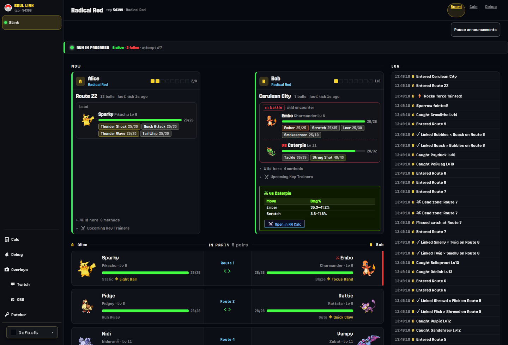
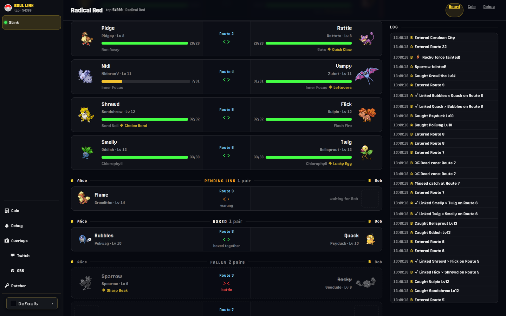
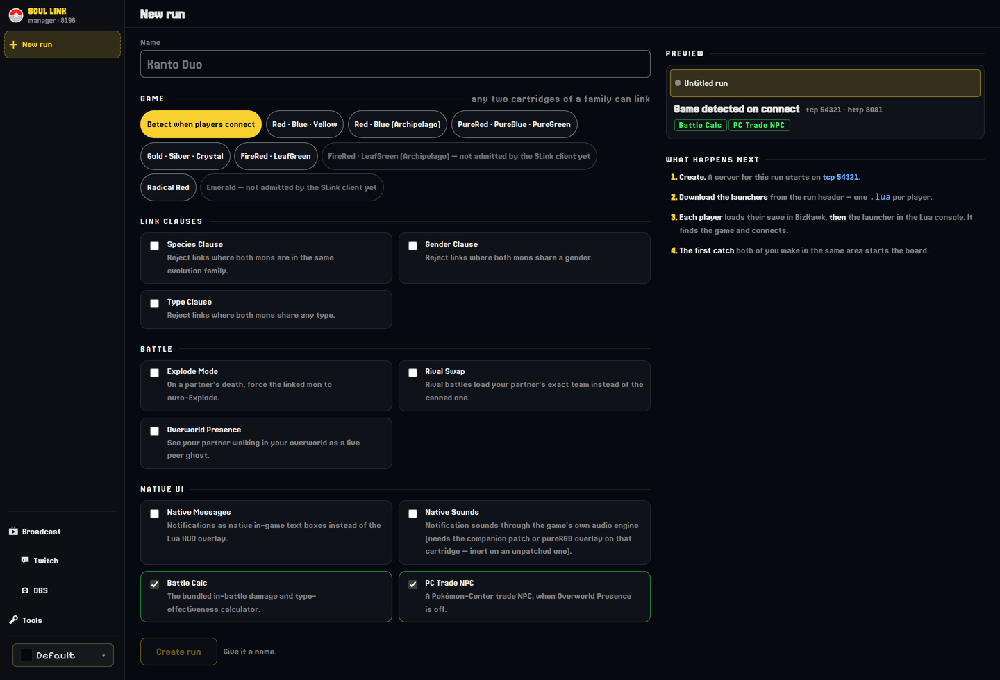
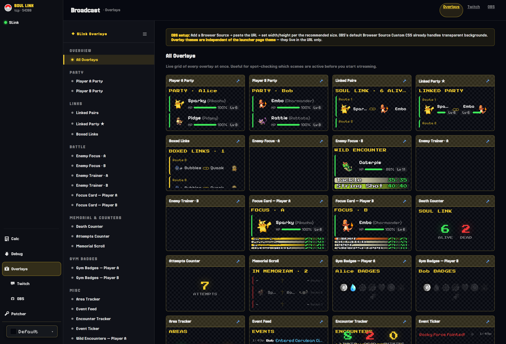
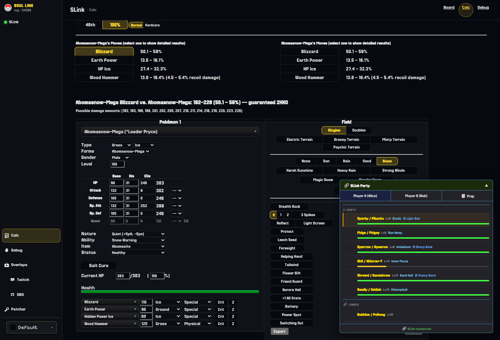
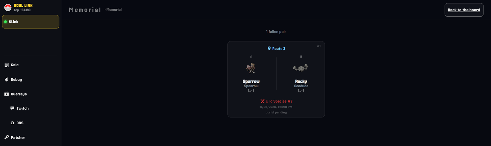

<div align="center">


# Auto-SoulLink

**A Pokémon Soul Link Nuzlocke that referees itself — proven on real cartridges for Gens 1–3, with Gens 4–5 experimental.**

<a href="https://github.com/howeasy/Auto-SoulLink/actions/workflows/test.yml"></a>


<a href="LICENSE"></a>

<br><br>



<sub>Both players' live position and battle, every linked pair underneath, the run's event log down the side.</sub>

</div>

---

Two people play two Pokémon games at once under Soul Link rules: your partners are paired by where
you caught them, and when one dies its partner dies too. Enforcing that by hand means pausing
constantly to check each other's parties. **Auto-SoulLink does it for you, live.**

A Lua client in each [BizHawk](https://github.com/TASEmulators/BizHawk) instance reads game RAM
every frame and streams events over TCP to a Python server. The server holds the rules — encounter
linking, the dead zone, faint propagation, party/box sync, the memorial box, the Nuzlocke ball gate
and the optional clauses — and writes commands straight back into the other player's game. Nobody
has to remember anything, and nobody has to trust anybody.

```
   Player A                                Player B
  ┌──────────┐                            ┌──────────┐
  │ BizHawk  │  events  ┌──────┐  events  │ BizHawk  │
  │  + Lua   │─────────▶│ SLink│◀─────────│  + Lua   │
  │  client  │◀─────────│server│─────────▶│  client  │
  └──────────┘ commands └──┬───┘ commands └──────────┘
                           │
                  board · OBS overlays · damage calc
```

**Jump to** — [Supported games](#supported-games) · [Quick start](#quick-start) ·
[The rules](#the-rules) · [On stream](#on-stream) · [Damage calculator](#damage-calculator) ·
[Tests](#tests) · [Docs](#documentation)

## Every pair, at a glance



The board sorts every link into *in party*, *pending*, *boxed* and *fallen*, each row showing A's
half, the bond and B's half. **Pending** is a catch waiting on the partner. **Boxed** pairs are in
the PC together, because a linked mon cannot sit in the party while its partner sits in a box.
**Fallen** pairs have already been walked to the memorial box by the server. Boxes and the memorial
are zones of this one page, not other pages.

## Supported Games

| Gen | Games | Status |
|-----|-------|--------|
| **1** | Red, Blue, Yellow | ✅ **Verified** — rules proven end to end on real cartridges by the 20-scenario duo harness |
| **1** | PureRed, PureBlue, PureGreen ([pureRGB](https://github.com/Vortyne/pureRGB) v2.7.6) | ✅ **Verified** — the same duo harness on PureRed↔PureBlue, PureRed↔PureGreen and the overlay pairing |
| **2** | Gold, Silver, Crystal (1.0/1.1) | ✅ **Verified** — 98 live duo/gate cells on real dumps of all three titles (C↔C, G↔S, C↔G) |
| **3** | FireRed, LeafGreen, Radical Red 4.1 | ✅ **Verified** — the frozen-cut gate passes FR/LG 43/43 and Radical Red 19/19 on real cartridges |
| **3** | Emerald, Archipelago FR/LG | ❌ Not supported — they ran only on the old Gen 3 client (tag `archive/gen3-old-client`); the launcher refuses them by name |
| **4** | HeartGold, SoulSilver, Platinum | ⚠️ Experimental — never run against a real game |
| **5** | Black, White, Black 2, White 2 | ⚠️ Experimental — never run against a real game |

Cartridges are admitted by ROM hash, not by header. Randomized and unpinned builds are refused by
name rather than mis-profiled — **except** the randomized pairs SLink builds itself, which it then
pins. Archipelago Crystal is **refused**, not experimental.

<details>
<summary><b>What "verified" means here</b> — each generation's evidence is a different shape</summary>

<br>

- **Gen 1 (Red/Blue/Yellow) and pureRGB** — the duo harness (`tools/e2e_duo.py`, game `gen1_new`)
  runs **20 scenarios** on two real cartridges through a real server. Four of them inject nothing
  at all: both players walk real grass, meet real wild Pokémon and throw real Poké Balls, and the
  server pairs the captures by area. `python tools/verify_gen1_release.py` runs all 18 lanes
  fail-closed — **a skipped test counts as a failure**, so a missing ROM cannot read as green.
  The honest limit: live play is proven in one encounter area; the other 38 rest on a generated
  oracle cross-checked against the ROM by a second independent path.
- **Gen 2 (Crystal/Gold/Silver)** — 98 live duo and gate cells on real dumps of **all three**
  titles, covering linking, the clauses, the ball gate, faint/whiteout/poison, PC and box ops,
  NPC and native trades, evolution, gifts and egg hatching. No title has a full playthrough: New
  Bark Town's west exit is script-locked until Elm hands over a starter, so there is no grass to
  walk.
- **Gen 3 (FR/LG and Radical Red)** — the largest live suite: FR/LG 43/43 and RR 19/19 at the
  frozen cut. Only pinned cartridges are admitted; header-only and randomized builds are refused
  by name.
- **Gens 4 and 5** — feature parity with Gen 3 on paper (moves/PP, stat stages, doubles, forms,
  egg detection, stream overlays) and their unit suites pass, but they have **never run against a
  real game**. Treat them as experimental. Their battle-struct addresses are scannable with
  `lua/tests/test_gen4_battlers_count.lua`, `test_gen4_stat_stages.lua`,
  `test_gen5_block_b.lua` and `test_gen5_doubles.lua`, and need a one-time live capture.

Per-generation detail: **[docs/gen1_gen2_runtime_checks.md](docs/gen1_gen2_runtime_checks.md)**.

</details>

## Before you start

| You need | Notes |
|---|---|
| **Python 3.11+** | `pip install -r requirements.txt` |
| **BizHawk 2.11+** (2.9+ for Gen 2) | Two instances, one per player. |
| **Two ROMs** | One per player, same **game family** — Red and Blue link, FireRed and LeafGreen link; a Radical Red run needs Radical Red on both sides. |
| **A full checkout, on both machines** | The launcher scripts are small stubs that `dofile` the real client out of this repo, so a remote friend needs the repo too — sending them just the `.lua` will not work. |

The LuaSocket DLL is **already committed** at `lua/x64/socket-windows-5-4.dll`. There is nothing to download.

## Quick Start

```bash
pip install -r requirements.txt
python -m server.manager --host 0.0.0.0
# open http://localhost:8090/
```



**1. New run.** Name it, pick the game family (or leave *Detect when players connect*), tick any
clauses or options. On Red · Blue · Yellow or PureRed · PureBlue · PureGreen the form also has a
**Cartridges** step — each player's cartridge, an optional **SLink companion** patch, and a
**Randomizer** section whose *Randomize* switch unfolds the settings. **Create run** starts its
server and makes the cartridges.

**2. Download the cartridges and the launchers.** The empty board offers *Player A · .gb* /
*Player B · .gb* when the run made them, then *Player A · .lua* / *Player B · .lua*; both are also
under *Launchers ▾* in the run header and on the run's **Cartridges** page.

**3. Load in BizHawk.** Each player loads their cartridge, then the launcher in the Lua console
(one per emulator). It finds the game and connects; that player's card on the board turns green.

**4. Catch something.** The first catch you both make in the same area starts the board.

> [!IMPORTANT]
> Load the script **after** loading your save file. Writes are disabled until SaveBlock validation
> passes.

> [!TIP]
> The theme picker at the bottom of the rail swaps the palette — default, Funtastic grape, jungle,
> fire, ice, watermelon, smoke, light and transparent. It persists in a cookie and applies on the
> first byte, so there is no flash of the wrong theme.

### Which server am I running?

Two ways to run SLink, on different ports. Picking the wrong URL is the most common first-run confusion.

| | Command | Open | Use when |
|---|---|---|---|
| **Manager** | `python -m server.manager --host 0.0.0.0` | `http://localhost:8090/` | The UI. Create runs, start and stop them, watch the board, build a randomized pair, pin a run for the stream overlays. Each run it spawns gets its own server starting at **8081**, but you never need to open it. |
| **Single server** | `python -m server.server` | `http://localhost:8080/` | One run, started by hand, no Manager. The same board. |

Both listen for the game clients on TCP **54321** (the Manager gives each spawned run its own TCP
port). If a port is taken, the server says so and suggests a free one instead of printing a traceback.

## The Rules

| Rule | What happens |
|------|-------------|
| **Encounter linking** | First catch per area by each player → permanently paired |
| **Dead zone** | Either player fails to catch → area locked for both |
| **Faint propagation** | One mon faints → partner is force-fainted instantly |
| **Party sync** | Linked mons must both be in party or both in box |
| **Memorial box** | Dead pairs move to the memorial box automatically |
| **Whiteout** | All party faints → all partner's linked mons faint |
| **Nuzlocke gate** | Rules inactive until the player actually has Poké Balls |

Gifts and eggs link under their own `gift_<area>` namespace, so a gift received in a real encounter
area no longer locks that area. Shiny bonus pairs are always on — catching a shiny grants the
partner an extra Soul Link slot.

**Optional clauses:** `--species-clause` (no shared evo family), `--gender-clause`,
`--type-clause`. All three are checkboxes in the new-run form.

<details>
<summary><b>Optional run augmentations</b> — Explode Mode, Rival Team Swap, native UI</summary>

<br>

| Flag | Effect |
|------|--------|
| `--explode-mode` | On a linked partner's death, the surviving mon is coerced into using **Explosion** mid-battle (`force_explode`) instead of a silent force-faint. Supported on Gen 1, pureRGB and Radical Red; Gen 2 says no. Check `supports_explode_mode()` on the adapter rather than trusting a list. |
| `--rival-team-swap` | On a rival battle, the rival's team is replaced live with the **partner run's current party** (`replace_rival_team`). Radical Red only; requires the companion patch. |
| `--overworld-presence` | **Peer ghost** — not in this release (planned after the RC). Leave it off: while it is on, the Pokémon Center trade NPC is disabled too, so there is no trade entry point. |

Per-run **native UI & audio toggles** (all require the companion patch, none change Soul Link
rules): `--native-messages` (notifications as native in-game text boxes instead of the Lua HUD),
`--native-sounds` (notification sounds through the game's own audio engine), `--no-battle-calc`
(hide the bundled in-battle damage calculator, shown by default), `--no-pc-trade-npc` (disable
Radical Red's Pokémon-Center trade NPC, on by default and only active while Overworld Presence is
off). Gen 1 trades at the Cable Club receptionist — the cartridge's own counter on the companion
patch or pureRGB overlay, the Lua HUD otherwise — which has no switch.

</details>

## On Stream



Every overlay is a transparent-background browser source, live at once on the **Broadcast** page so
you can spot-check which scenes are worth wiring up before you start streaming. Party cards, linked
pairs, enemy focus with live PP, the death feed, badges, the attempts counter, the memorial scroll,
the event ticker and the per-area encounter tables.

**OBS scene triggers** switch scenes for you: connect each player's OBS over obs-websocket, then
drag rules into priority order — `shiny`, `link_death`, `whiteout`, `dead_zone`, `battle_start`,
`run_over` and a dozen more.

**A Twitch bot** answers `!rip`, `!runstats`, `!partner <name>`, `!area <name>`, `!alltime` and
`!soullink` from live run state.

<details>
<summary><b>OBS setup and the full trigger list</b></summary>

<br>

1. In OBS, enable **Tools → WebSocket Server Settings** (obs-websocket v5, OBS 28+). Set a port (default 4455) and optional password.
2. Open **Broadcast → OBS** (`/broadcast/obs`, or the run's `/obs`), enter the host/port/password for each player's OBS instance, and click **Connect**.
3. Add trigger rules: choose an event, which player triggers it, which OBS to target, and the scene to switch to.

| Event | When it fires | | Event | When it fires |
|-------|--------------|-|-------|--------------|
| `battle_start` | Any battle begins | | `capture` | A Pokémon is caught |
| `wild_battle_start` | Wild encounter starts | | `shiny` | A shiny is caught |
| `trainer_battle_start` | Trainer battle starts | | `faint` | Own mon faints |
| `battle_start_new` | Battle in an area with an open encounter slot | | `link_death` | Partner's linked mon faints |
| `battle_end` | Battle ends (returned to overworld) | | `whiteout` | Full party wipe |
| `area_enter` | Player enters any area | | `linked` | Area becomes fully linked |
| `area_enter_new` | Player enters an area with an open encounter slot | | `dead_zone` | Area becomes a dead zone |
| `party_to_box` | Mon moved to PC | | `memorialize_done` | Dead pair memorialized |
| `box_to_party` | Mon retrieved from PC | | `run_over` | No usable pairs remain |

Rules are evaluated **top to bottom** — when several events fire in the same frame, the highest-ranked
rule wins per player. Drag the ⠿ handle to reorder. Changes save automatically.

</details>

<details>
<summary><b>Twitch bot setup</b> — app registration, tokens, environment</summary>

<br>

> **Requires twitchio 3.x** — the old IRC-based integration is discontinued by Twitch. This uses EventSub WebSocket.

You can run the bot as your **broadcaster account** (simpler) or as a **separate bot account**
(recommended for stream). Both use the exact same code and token setup — the only difference is
which Twitch account you authorize in step 2.

1. **Register a Twitch Developer app** (on your own account) at [dev.twitch.tv/console](https://dev.twitch.tv/console) → Register Your Application.
   - Name: anything, Category: Chat Bot, Client Type: Confidential
   - **OAuth Redirect URL: `https://twitchtokengenerator.com/`** ← required so twitchtokengenerator can complete the auth flow
   - Copy the **Client ID**. Click **New Secret** and copy the **Client Secret**.

2. **Get tokens for the BOT account** at [twitchtokengenerator.com](https://twitchtokengenerator.com):
   - Broadcaster account: stay logged into your normal Twitch account. Separate bot account: open an incognito window and log in as the bot first.
   - Select **Custom Scope Token**, paste your **Client ID**
   - Enable scopes: `user:read:chat` `user:write:chat` `user:bot` `channel:bot`
   - Generate, authorize **as the bot account**, and copy the **Access Token** and **Refresh Token**.

3. **Set environment variables** before starting the server or manager:

   ```powershell
   $env:TWITCH_ACCESS_TOKEN = "bot_access_token"    # from twitchtokengenerator (bot account)
   $env:TWITCH_REFRESH_TOKEN = "bot_refresh_token"  # from twitchtokengenerator (bot account)
   $env:TWITCH_CLIENT_SECRET = "your_client_secret" # from dev.twitch.tv/console → your app → New Secret
   python -m server.manager
   ```

4. **Configure on the Twitch page** (`/twitch`): your broadcaster **Channel** and the **Client ID**
   from step 1, then **Save Config** and **Reconnect**. The status panel shows connection state and errors.

| Command | Description | | Command | Description |
|---------|-------------|-|---------|-------------|
| `!soullink` | Plain-English Soul Link rules | | `!alltime` | Cross-run aggregate: attempts, deaths, shinies |
| `!clauses` | Active clause rules | | `!lastrun` | How the previous run ended |
| `!rip` | Most recent death with killer detail | | `!attempts` | Current attempt number |
| `!runstats` | Attempt #, alive/dead counts, oldest pair | | `!partner <name>` | A mon's Soul Link partner, by nickname |
| | | | `!area <name>` | An area's link status |

</details>

## Damage Calculator



A fork of the Smogon damage calculator, bundled and wired to the run: the **SLink Party** panel on
the right carries both players' live parties, so a set is two clicks away instead of retyped. Each
adapter picks its own dex through `calc_profile()` — vanilla, pureRGB or Radical Red — and a
generation that returns `None` simply has no calc.

Radical Red runs also get an **Upcoming Key Trainers** panel on the board: the next gym leaders and
rivals against your party's level, with an *Open in Calc* button that loads their set.

## The Memorial



Every fallen pair gets a card — both halves, the area that linked them, what killed them, and when.
The server also walks the bodies to the memorial box in-game once both clients report a safe
overworld state. Which box that is comes from the adapter, not a constant: Gen 1, pureRGB and Gen 2
use the last box; Gen 3 uses the UI's Box 25 on Radical Red (25 boxes) and Box 14 on vanilla (14).

## Cartridges, patches and randomizers

<details>
<summary><b>Run Manager</b> — building the cartridges, randomized pairs, presets</summary>

<br>

```bash
python -m server.manager --host 0.0.0.0
# http://localhost:8090/          the first running run's board
# http://localhost:8090/new       create a run: game family first, options greyed with reasons
# http://localhost:8090/runs/<id> a run's board (live, or what it persisted once stopped)
# http://localhost:8090/broadcast the overlay gallery
# http://localhost:8090/tools     the patcher and the Gen 1 randomized-pair builder
```

**Cartridges (Gen 1).** A Red · Blue · Yellow or PureRed · PureBlue · PureGreen run makes each
player's cartridge from what was picked and hands it out (`server/cartridges.py`). The picker lists
every `.gb`/`.gbc` in the SLink folder, `roms/`, `patch/build/` and the `.cache/purergb*` build
folders, each named for what it is — *Red · clean dump*, *PureBlue · pinned pureRGB v2.7.6 build*,
*PureBlue · SLink companion overlay* — and greys what the run cannot start from (anything already
modified) or cannot take (a vanilla dump on a pureRGB run, and the reverse, are refused by name
before anything is spent). *Add file…* is the browser's own file dialog; the file lands in `roms/`.

- **SLink companion** puts the native Cable Club trade and the START-menu SLINK panel on the
  cartridge. Vanilla Red/Blue: the published UPS (`patch/dist/SLink-RB-*.ups`) on a clean dump, or —
  when randomizing — the structural injector (`patch/gen1/tools/inject.py`) *after* the randomizer,
  since a UPS is bound to one exact source. pureRGB: the companion is the overlay build
  (`patch/dist/SLink-Pure*.ups` on the pinned build), made *before* randomizing. Yellow has no
  companion build (no free WRAM for the mailbox) and plays with the Lua HUD. The patch is optional
  either way.
- **Randomize** builds one randomized cartridge per player — same settings, different seeds — from
  your own copy of Universal Pokémon Randomizer ZX (put `PokeRandoZX.jar` in the SLink folder or
  `.cache/upr/`, pick it with *Pick…*, or set `SLINK_UPR_JAR`; Java must be on `PATH`; pureRGB needs
  the SLink fork jar). Choose what to randomize and how hard — wild/static/trainer modes, level
  curves (−50…+50 %), fully-evolved-from-level, similar strength, rival keeps starter, minimum catch
  rate, TM compatibility, field items and the misc tweaks. The run then admits only those two
  cartridges (`rom_contract.json` binds each player's *final* cartridge: content fingerprint and full
  sha1). Types, evolutions, movesets, base stats, EXP curves and in-game trades are never randomized,
  so the species and type clauses mean the same thing on both sides; the full list is
  `server/upr_settings.py::OPTIONS`.

Downloads are named `slink_<run>_a` / `_b` with the source's extension — `.gb` for a Red/Blue dump,
`.gbc` for Yellow and pureRGB. Keep the extension: BizHawk picks the system by it for a ROM its
database does not know, so a pureRGB cartridge renamed `.gb` runs on the DMG core in mono.

*Presets and settings files.* *Save* keeps the randomizer's settings by name on this Manager
(`data/runs/presets.json`); *Export .rnqs* / *Import .rnqs…* speak UPR's own settings file, so two
players can trade settings. An imported file goes through the pipeline's own gates: a file that
randomizes types is refused by name, not silently read as "unchanged".

</details>

<details>
<summary><b>pureRGB</b> — the second Gen 1 foundation</summary>

<br>

[pureRGB](https://github.com/Vortyne/pureRGB) is supported as a second Gen 1 foundation
(`game_id gen1_purergb`) beside vanilla Red/Blue/Yellow, from **exactly one pinned release**
(v2.7.6, commit `7e7a4653`; `data/purergb_sources.lock.json`). Build the three cartridges from
source with `python tools/build_purergb_syms.py` (RGBDS 1.0.3 + w64devkit, pinned by sha256; the
build must reproduce the release ROMs byte for byte or nothing is published) or apply the upstream
`.bps` to a clean Red/Blue dump — either way the client admits a cartridge by its **full ROM sha1**
(`data/games/gen1_purergb/admission.json`), never by the header (PureRed/PureBlue keep the
`POKEMON RED`/`BLUE` header), so an older or newer pureRGB version is refused, not mis-profiled.

Every game fact — engine hook bytes, the overworld write checkpoint, 190 species including the 13
forms/spirits and MissingNo, pureRGB's own typings, evolutions, 78 encounter areas, trainers, items,
charmap — is generated from the pinned source and verified against the built ROMs. Rules are the
vanilla rules; two pureRGB-specific identity events are handled as `key_change`: script
transformations (Volcano Magmar, Diamond Mine Onix, …) and the **APEX CHIP** (which maxes DVs — a
same-species/same-OT duplicate would collide, so the client restores the DVs and the run refuses the
collision). A pureRGB run pairs **only with pureRGB** (a vanilla↔pure hello is refused as MIXED
GAMES), needs BizHawk in **GBC console mode** (DMG/SGB unsupported), and Explode Mode works through
pureRGB's own rule (EXPLOSION self-KOs below ⅓ HP; the client puts the battler there first).

**Companion overlay.** The native trade + START-menu SLINK panel are a **source overlay** linked
into the pureRGB build (`patch/gen1/purergb/`, `python tools/build_purergb_overlay.py`) and shipped
as `patch/dist/SLink-Pure{Red,Blue,Green}.ups` over the pinned pure ROM. The overlay build
additionally refuses a *colliding* APEX CHIP use before the chip is consumed. A clean pure save
loads on the overlay build unchanged.

**Randomized pairs.** The Manager's randomizer runs pureRGB through the SLink fork of UPR ZX 4.6.1
(`python tools/build_upr_fork.py --bootstrap`, `4.6.1-slink3` — the pipeline refuses an older fork
revision): a lossless handler (an untouched pure ROM round-trips byte-identically), pure INI entries
generated from the pinned symbols, and every code-patching tweak off (pureRGB has instant text
natively); one tweak is allowed, lower-case names, a data write the fork re-cases byte-for-byte over
the name table.

**Where to read more.** `docs/purergb/CHANGELOG.md`, `docs/REFERENCE.md` (the Gen 1 · pureRGB
bullet), `docs/purergb/PLAN.md`.

</details>

<details>
<summary><b>Companion patch (Radical Red)</b> — native trade, message boxes and a START-menu panel</summary>

<br>

An optional UPS patch (`patch/`) injects native SLink support into the Radical Red ROM. It enables
**native trade** (talk-to-partner / PC trade NPC), **in-battle notifications**, **native message
boxes and sounds**, the bundled **Battle Calc** damage display, the native Rival Team Swap path, and
a **Soul Link entry in the game's own START menu** that opens a native run summary — linked pairs
with both halves' HP, status and level, dead zones and badges — so you can check the run without
leaving the game. The peer-ghost/Overworld Presence NPC opcodes are built into the patch but not yet
driven by the rewritten Gen 3 client (deferred post-RC).

Build it with `patch/tools/build.py`; apply it in the browser at `/patcher` (also served on the
Manager port) or download the `.ups` from `/companion/SLink-RR.ups`. Nothing is uploaded — the
patcher runs client-side. See [patch/README.md](patch/README.md) for the full feature list and
opcode reference.

</details>

<details>
<summary><b>Every page the run server serves</b></summary>

<br>

Everything lives on the **Manager** (port 8090): the rail lists your runs; each run has its board
(`/runs/{id}`), its damage calculator (`/runs/{id}/calc/normal.html`) and its debug tools
(`/runs/{id}/debug`); **Broadcast** is the overlay gallery with the pinned run's Twitch bot and OBS
triggers; **Tools** is the patcher and the randomizer. The paths below are what a per-run server
renders on its own port when run standalone (`python -m server.server`):

| Path | Description |
|------|-------------|
| `/` | The board — parties, encounters, linked pairs, area states, enemy battle info, and the **Upcoming Key Trainers** panel. Morph-swapped every 2 s, preserving scroll and `<details open>` state. |
| `/memorial` | Tombstone cards for dead pairs |
| `/obs` | OBS scene trigger configuration |
| `/twitch` | Twitch bot configuration and activity log |
| `/debug` | Manual linking, event injection, state toggles, backup rollback |
| `/stream/` | Stream overlay index — preview and configure all overlays |
| `/stream/party-a`, `/stream/party-b` | Party cards with HP bars, moves, held item, status, stat stages |
| `/stream/links` | Linked pairs with both mons side by side |
| `/stream/linked-party` | Party filtered to only linked mons |
| `/stream/deaths` | Death feed with sprites and cause |
| `/stream/encounters` | Encounter log per area |
| `/stream/enc-table-a`, `/stream/enc-table-b` | Wild encounter rate table for the current area (RR/CFRU) |
| `/stream/areas` | Area link state grid |
| `/stream/focus-a`, `/stream/focus-b` | Active battle mon — large sprite, moves, type matchups |
| `/stream/enemy-focus-a`, `/stream/enemy-focus-b` | Active enemy mon(s) — large sprite, moves, live PP. Singles or doubles. |
| `/stream/enemy-trainer-a`, `/stream/enemy-trainer-b` | Trainer's full team — PARTY-style autoscroll |
| `/stream/ticker` | Scrolling event ticker |
| `/stream/badges` | Badge display |
| `/stream/stream-memorial` | Memorial wall for stream |
| `/calc/` | Damage calculator with the live party bridge |
| `/patcher` | In-browser companion-ROM patcher (also on 8090) |

</details>

## Tests

```bash
pytest tests/unit/ -v                          # ~14,200 tests, no emulator needed
pytest tests/ -q                               # + integration, live and e2e collection (~14,500 total)

# Headless BizHawk gates — drive a real emulator
SLINK_LIVE=1 pytest tests/live/ -q             # headless gates for every generation

# Two-instance end-to-end: two emulators + a real server
SLINK_E2E=1 SLINK_LIVE=1 pytest tests/e2e/ -q  # duo scenarios for Gen 1, Gen 2 and Gen 3
python tools/verify_gen1_release.py --list     # Gen 1's 18 release lanes and what each judges
python tools/verify_gen2_release.py --list     # Gen 2's release lanes
python tools/gen3_final_cut.py --cut <sha> --list  # Gen 3's final-cut rows
```

The live gates and duo scenarios need BizHawk and the ROMs. Gen 3 also needs current savestates
(`python tools/mkstates.py`); Gen 1 and Gen 2 boot from committed battery saves instead, so there is
nothing to rebuild after an emulator upgrade. Everything skips cleanly when a ROM or fixture is
missing — and the release gates count a skip as a failure, so a missing input cannot read as green.
See [tests/TESTING.md](tests/TESTING.md).

<details>
<summary><b>Project structure</b></summary>

<br>

```
lua/
  slink.lua              # Universal entry point (auto-detects game)
  gen1/, gen2/, gen3/    # Composition roots — the rewritten clients (each owns its entry.lua)
  core/                  # Shared runtime (session, identity, deferred) used by gen1-3
  clients/, games/       # Gen 4/5 clients and their game config
  connector.lua          # Non-blocking TCP wrapper
server/
  server.py              # TCP + HTTP server (aiohttp)
  state.py               # SoulLinkState FSM
  adapters/              # Game-specific adapters (gen1-5) — all game facts live here
  obs_controller.py      # OBS WebSocket scene triggers
  twitch_bot.py          # Twitch chat bot (twitchio 3.x)
  pokemon_data.py        # Species, abilities, types, evos
  templates/             # Jinja2: the shell (_rail, panel_page, dashboard, manager), panels, stream/*
  static/                # CSS, JS, fonts, vendor bundles; themes/ has one file per palette
  overlay_catalog.py     # Stream overlay registry (URLs, layouts, query params)
  patcher.py             # /patcher page + /companion/SLink-RR.ups routes
patch/                   # Companion ROM patches (Gen 1, Gen 3/RR, pureRGB overlay) + dist .ups
data/games/              # Per-game static data (area maps, items, admission pins)
calc/                    # Damage calculator, Gen 1/2/3 + live bridge
tests/                   # unit (14,215), integration, live BizHawk gates, two-instance E2E
  fixtures/gen1, gen2    # committed battery saves the GB duo runs boot from
tools/                   # Code generators, release gates, duo harness
```

</details>

## Documentation

| Document | What it covers |
|---|---|
| **[docs/REFERENCE.md](docs/REFERENCE.md)** | Full technical reference: every HTTP endpoint, per-generation memory maps, adapter architecture, area normalization |
| **[docs/protocol.md](docs/protocol.md)** | The client/server wire protocol, event by event and field by field |
| **[tests/TESTING.md](tests/TESTING.md)** | How to run every suite, and the rule that **absent input skips, present-but-wrong input fails** |
| **[docs/gen1_gen2_runtime_checks.md](docs/gen1_gen2_runtime_checks.md)** | What live verification covers per generation, and what is still open |
| **[docs/purergb/](docs/purergb/)** | The pureRGB foundation: plan, changelog and the research it rests on |
| **[docs/gen2/](docs/gen2/)**, **[docs/gen3/](docs/gen3/)** | Per-generation plans, tickets and review records |
| **[docs/historical/](docs/historical/)** | Finished, superseded or abandoned efforts — kept for the reasoning, never read as instructions |
| **[.github/copilot-instructions.md](.github/copilot-instructions.md)** | Exhaustive developer notes: RAM addresses, struct layouts, and why the adapter isolation rules exist |

## Licence

SLink is **MIT** — see [LICENSE](LICENSE).

Two boundaries matter if you redistribute, and [NOTICE.md](NOTICE.md) has the detail:

- `patch/upr/` is **GPL-3.0**: those are patches against Universal Pokémon Randomizer ZX. SLink
  never links against it — it runs the built jar as a separate process — so the rest of the
  repository stays MIT.
- `calc/` is a fork of the MIT-licensed Smogon damage calculator, upstream licence retained.

**No ROMs and no savestates are distributed here.** Bring your own dumps of games you own. The
committed `.SaveRAM`/`.sav` files are battery saves containing no game code
([tests/fixtures/README.md](tests/fixtures/README.md)).

## References

- [pret/pokefirered](https://github.com/pret/pokefirered) — FRLG decompilation
- [pret/pokered](https://github.com/pret/pokered) / [pokeyellow](https://github.com/pret/pokeyellow) — Gen 1 decomps
- [pret/pokecrystal](https://github.com/pret/pokecrystal) — Crystal decomp
- [Skeli789/Complete-Fire-Red-Upgrade](https://github.com/Skeli789/Complete-Fire-Red-Upgrade) — CFRU engine
- [BizHawk Lua Functions](https://tasvideos.org/BizHawk/LuaFunctions)
- [funnotbun RR Pokédex](https://funnotbun.github.io/) — Radical Red data

<div align="center">
<sub>Pokémon is a trademark of Nintendo, Creatures Inc. and GAME FREAK Inc. This is an unaffiliated fan tool.</sub>
</div>
